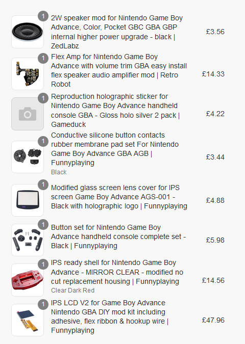
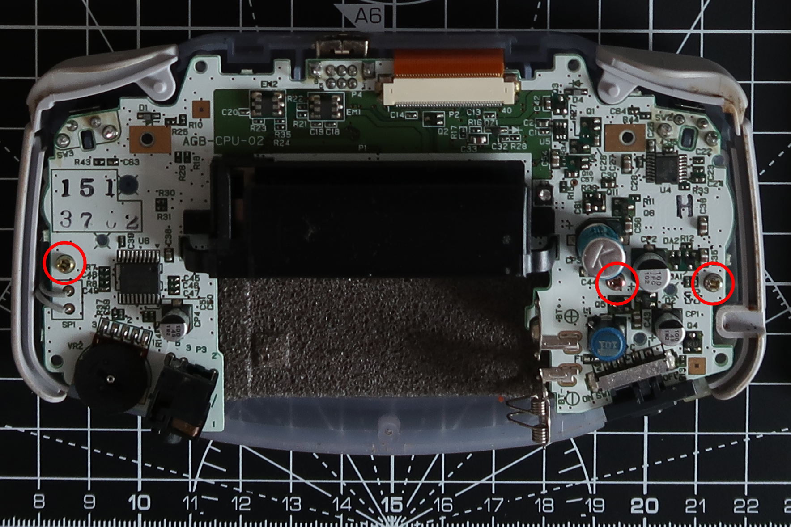
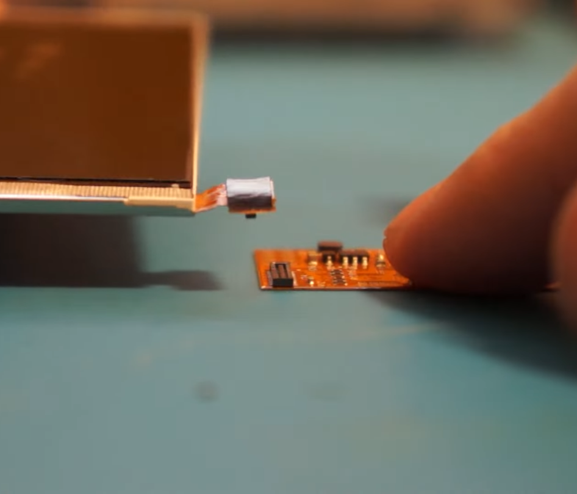
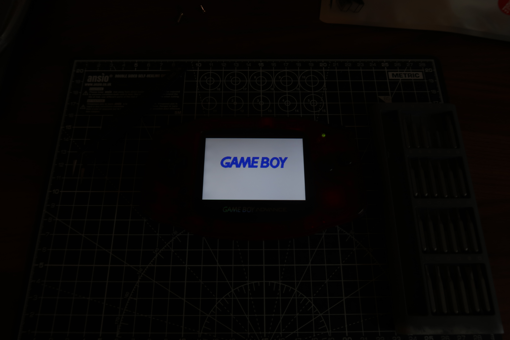

### Some background
It's a suprise to no-one in my social circles that I'm a massive gamer, so by the law of attraction my best friend happens to be a gamer himself, particularly a Nintendo fan. He's been collecting games and consoles for a while and whilst we both fuel each other's collection, I wanted to get him something unique and special but still in line with our personalities and usual gifts. We were walking down the street one day discussing our childhood and first real exposure to gaming. With my friend being Chinese, I was particularly invested in the discussion and the difference in experiences we both had considering that most games from 2000 up until 2015 where banned within mainland China. I found out that his first console like many was the Game Boy and he shared some funny anecdotes about how his Grandfather managed to sneak the Game Boy from Hong Kong and how, because games were so hard to come by, an entire classroom would share and single game cartridge or trade different demo or pirate copies of games. Particularly, he told me about his escapade with Castlevania and how he excitedly thought he managed to het his hands on the renowned Konami masterpiece when in reality he only had a demo copy.

It was from there that I had an idea to mod a Game Boy and present it as a gift on his next birthday. I figured it would be a nice little intro expierence into electronics and thought that documenting the process would show the love and labour that went into it! After doing a bit of reaseach into modding retro hand-helds I decided on the Game Boy Advanced as it seems to be a popular choice within the modding community and as a result is a well documented process.  

### What you'll need for the mods
It should go without saying but you'll need a Game Boy Advanced, so if you need me to tell you that... I don't know what to say... You'll also need to purchase some addtional parts (some of which are optional) depending on the mod you'd like to carry out. I purchased the below parts however, I would recommend that you read on before pulling the trigger on purchasing anything. Now having experience to draw from, I would have done things differently.

Firstly the core of this console mod without a shadow of a doubt is the IPS display. It's probably the reason you should be modding the console in the first place. After doing a bit of research, I opted to get the Funnyplaying IPS V2 screen with flex ribbon. The screen from what I can tell offers the greatest visual clarity and vibrancy however, there are alternatives that can perhaps offer a more retro look like the AGS-101 or Retrosix CleanScreen.

I purchased all my parts from ZedLabs but Retrosiz and Retromodding are also great for sourcing fancy new parts.

As you can tell from the above I purchased a replacement speaker and audio amplifer. In Hindsight if I was going to attempt these mods again I would recommend that you switch the Retro-Tobot mod out for something more beginner firendly like the CleanAmp Pro as there is more documentation surrounding the installtion o0f the amp. The solder points are more or less the samefor both amps, however I made some mistakes as this was my fist project requiring soldering and alligment of the amp proved to be quite tricky. It was a learning expierence.

Given the above information, you'll also require the appropriate tools (again depending on the parts you've purchased).

* A Tri-wing screwdriver (Y0.6)
* A Philips screwdriver (PH00)
* A soldering iron, flux, solder etc. (Only technically required for any audio mods)

### Installing the mods

After having tested to confirm your Game Boy is working etc, de-shelling the Game Boy is pretty straight forward. Turn the console over and remove the battery cover. You'll notice 7 screws on the back. I've circled the Tri-wing screws in red and the Philips screw in green.

Simply unscrew these screws and the backplate of the console should detach from the rest of the console to reveal the internal motherboard.

Once you've removed the backplate, you're almost ready to remove the motherboard. Lift the tabs on the locking mechanism that hold in the current screen's ribbon cable, which I've circled in red below. Also take note of the number of pins your board has, this is usually printed on the board (circled in green). I ended up having to use a 32 pin board after failing to solder the speaker mods properly.

Once you've unlocked the ribbon cable from the motherboard. There will be Philips screws holding the board onto the front plate. Unscrew these screws.

Now you can gently remove the motherboard from the console's shell.

At this point, I had attempted to solder the board, and it's speaker. You can attach attach various speaker mods if you've got the soldering expierence, however I ultimately ended up ruining the board pictured above... If you see further pictures showing a 2 volt speaker. It can be ignored.

The screen can be assembled pretty easily, there is a small FPC that connects the new ribbon and the screen itself. Given how small this was, I had difficulties photographing this process. My camera wouldn't focus. I did manage to find the below photo online though which should give you an idea of what you are doing. Just be careful that you've properly aligned the connectors when you apply pressure, as these parts are fragile and easily broken.

The beauty of the screen mod is that you don't necessarily need to solder. So more or less, with the new case I purchased, I just had to ensure that the screen was alligned propoerly and installed. As below, you'll notice that the ribbon has both a 32 pin and a 40 pin connector. Given that I had to get a new board, I had to fold down the 40 pin connector and fold the 32 pin connector upward in place of the 40 pin.

After that, it's a really simple assembly. Just pop in the buttons and silicon pads and run the above disassembly steps in reverse, install the stick on glass screen cover and any other cosmetic stickets and carefully put everytyhing back together. You should be left with a stunning end product.

### The before and after

I feel that the results speak for themselves, and it was a nice project at least to introduce me to soldering and electronics. I'll likely do some similar projects in the furture but for now I hope this makes a nice gift and becomes a treasured piece of his collection! 
