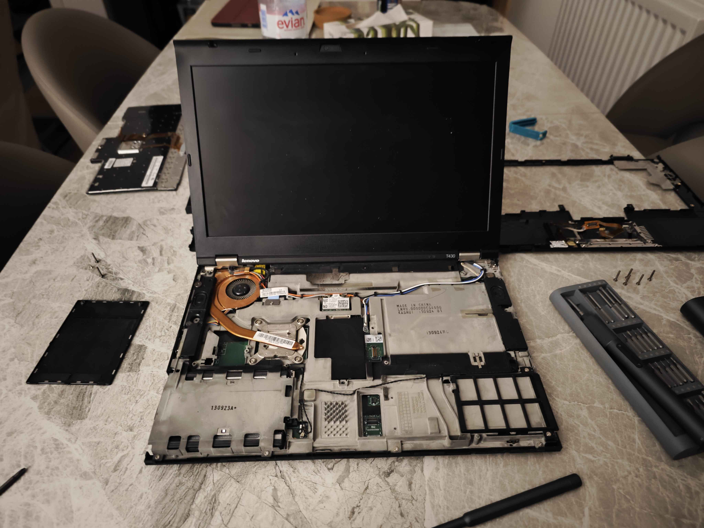

+++
title = "Experiences with Modding and Using the T430" 
date = 2024-09-16 
+++

*The information detailed below should only serve as general document. If you are reading this, I assume no responsibility or liability for any errors or omissions in the content of this article. Follow any instructions detailed below at your own risk. I will not be responsible for any issues that may arise from the use or misuse of the information provided.*

# Prerequisites

1. You might want to consider patching the embeded controller firmware. Flashing the EC will allow you to install the classic IBM model T400 keyboards. The classic keyboards are objectively superiour to the newer island style keyboards. Fortunately the work has been done for this by [Hamish Coleman ](https://github.com/hamishcoleman). The [thinkpad-ec repository](https://github.com/hamishcoleman/thinkpad-ec) contains these patches alongside insturctions.

2. It's strongly advised that you flash your bios. There are a few benefits to flashing your bios such as overclocking support,access to the advanced menu, but the primary reason for me was to remove the annoying bios WLAN whitelist. There are a number of ways to flash the bios but the simplist is to use [ivyrain](https://1vyra.in/) by [n4ru](https://github.com/n4ru).

**NOTE:** *For some reason when I flashed my bios using n4ru's script my bios was updated, this meant I couldn't then flash the embeded controller without rolling the bios back again. This is just something to note*

Additionally the following purchases are advisable:

1. [T430 FHD Kit](https://www.aliexpress.com/item/1005006756084192.html) (reliability on these aren't gaurenteed)

2. A Mini PCIE WLAN card (I purchased this [one]( https://www.aliexpress.com/item/1005006863944001.html))

3. One of the following recommended displays: 
    * B140HAN01.0 / B140HAN01.1 / B140HAN01.2 / B140HAN01.3 (requires LCD controller)
    * LP140WD2(TL)(E2) - The first generation X1 Carbon Displays - Installation guide [here](https://www.thinkwiki.org/wiki/Replacing_T430_screen_with_a_better_one#X1_Carbon_HD.2B_TN_Panel)
    * B140RTN02.1 - Dell Alienware M14x R2
    * LP140WD2(TL)(G1) - similar display found in the Dell Alienware M14x above

4. 7-row "Classic Keyboard" (Once installed you'll need to carry out the EC Flash)

5. SATA bay drive caddy (This allows you to swap out the DVD drive in your T430) - pretty much plug and play

Additionally I would recommend the purchase of a [G2 Socket CPU](https://www.cpu-world.com/Sockets/Socket%20G2%20(rPGA988B).html). This is something I'm yet to install myself but I'd recommend the purchase of either:
1. i7–3540M (35W/2C/4T/3.0GH/3.7GHt) - It's the best in class dual core chip (if you don't need multi-threading)
2. i7–3632QM (35W/4C/8T/2.2GH/3.2GHt) - Despite it's base speed this chip will outperform the i7-3540M in most use cases

The above listed CPUs don't require a *non*-delta fan or headsink mod. So I'd be inclined to go with either of the above, however another popular choice is the i7–3840QM (45W/4C/8T/2.8GH/3.8GHt). It has a higher TDP and allows you to sustain a much higher clock speed without throttling. Thermal performance is where this chip loses in my books though.

# Teardown
I'm not going to go into too much detail regarding the entire teardown because admittedly when I started this project, it was quite late in the evening and my patience and attentiveness was starting to suffer as a result. There is extensive online resources including a copy of the [official manual](https://www.levnapc.cz/ProductsFiles/Lenovo-t430-manual-en.pdf). For any gaps I will provide links I found helpful. I'll also provide some *tips and tricks* I used during installation of certain mods.

The fist part was removing the battery and pressing the power button a couple of times. Then flipping the machine over to the other side, there are a number of screws in the back that need to be removed. Fortunately all Philips screws so it's really easy to access. Essentially all the screws on the back can be removed, just take care, the two top right and left screws are for the lid hinges. You also need to remove the hard drive cover. 

**NOTE:** *Ensure that you remove the two screws holding down the keyboard. There are two behind the RAM and CMS battery backplate. They are labled and the only two screws behind the backplate so messing this up is difficult.* 

*foreshadowing...*

After having removed the screws you can flip the device, open the lid and remove the keyboard. It's easy enough to remove if the screws holding it in place have been removed. Push the keyboard towards the screen then gently lift the keyboard away from the rest of the device. Take additional care when removing the keyboard. You could easily damage the connector whilst the keyboard is still attached via the ribbon cable, or you could damage the ribbon cable itself which would need replacing if you planned on reusing the original keyboard.

Now that the keyboard is removed you can begin to remove the palm rest. Again, there will be some screws holding the palm rest onto the chasis of the device. So ensure that these are unscrewed before removing. Likewise with the removal of the keyboard there is also a ribbon cable connecting the trackpad to the motherboard so again, take care with it's removal. 

You'll now want to unscrew the the tab securing the current screen's connector into the socket. Once unscrewed it's a simple case of pulling on it gently to remove. The screen's bezel can simply be pried off (albeit carefully if you want to save the screen). Removing the scren from there is removing the screws allowing access to the hinges and unscrewing the screws holding the screen in. 

From there you simply attach the converter cable into the new screen (which can be a fiddly process) then install the screen which should allign correctly with the notches and screw holes to secure it. After that is's simply a case of routing the cables and more or less reversing the steps you just took. 

**NOTE:** *A nice tip is that if you carefully reinstall the battery (you can do this without totally securing the screen) and then reattach a keyboard. You can then test everything actually works before complete reassembly.*

You'll notice I also installed the PCIE WLAN card. This is as simple as installing an NVME drive. Just remove the screws holding it into the socket and carefully remove the antennae.

Atfer it's a case of following everything in reverse order. Reinstalling all the screws etc. There is extensive online documentation for this and the above linked manual is very helpful. I had originally modded a T430s before "upgrading" to the T430 so it was essentially a lift and shift job for me. There are some steps involved in modifying the keyboard to fit the 30 series models. This is a link to the [guide](https://www.instructables.com/ThinkPad-T430T430sX230-Classic-Keyboard-Mod/) I previously followed.

I actually messed up here. There was one screw holding down the keyboard which lead to a little warping on the right hand  sidewhen I attempted to pry it out the previous machine! It's all fine though, personally I like it, the laptop has some character because of it.

# Experience

The T430 still remains a popular machine and it's not uncommon to see it pop up on [Thinkpad Forums](https://forum.thinkpads.com/). I was able to get the T430 in really superb condition with the ultra-dock for around 70 GBP. They are great machines all round with great durability, ultilitarian design, have excellent Linux and BSD support and are evidently easy to modify and repair. If you are beginning out in Linux, I would argue that they are a great pickup over something like say a raspberry pi, considering they adequately powerful assuming later down the line you want to convert it into a server as such. I still prefer to use a thinkpad despite having arguably superior hardware at arms reach for general computing tasks. So at the very least they make for great general use machine.  

Ultimately I am really happy with the mods I've complete so far. I've more mods to carry out but it's a really comfy machine. It's probably the only laptop that I don't mind using as is. It's not without drawback though, you can really hear the fans on this thing compared to it's modern counterpart. For comparison, I don't think I've ever heard the fan on the X1 carbon (which I primarily use for work) or the Macbook pro, but the fans on the T430 really go for it! I don't mind it too much, but if you're an introvert like me, it will maybe catch you some glances in the local cafe. 

Another "charming feature" of my personal thinkpad is I actually had to modify the sata bay caddy. The cover for the caddy wasn't actually flush and it didn't have the cutout. So I had to go at it with some snippers. It doesn't bother me much as it's only really noticable if you look closely, and considering the cost for the drive caddy, I'm still happy with this. It's much more pratical having a hardrive than the plastic cover shipped with the device out the box. This type of thing might annoy others though. So maybe do more reserach than I did the plug-in attachments. 

I'm a fan of Thinkpads and I don't regret my decision to get this guy. There are a couple more modifications I plan on doing but for a bit of bed programming it's really nice. It's also really sweet for doom scrolling social media, watching anime and movies and unix-ricing to share with all the other "Thinkpad power users"...

## Other useful resources
* [n4ru's T430 modding guide](https://medium.com/@n4ru/the-definitive-t430-modding-guide-3dff3f6a8e2e)
* [Wolfgang's video on upgrading the T430](https://www.youtube.com/watch?v=r2v-Y8CdE1w)
* [4chan's /g/ (there is usaully a "Thinkpad General")](https://boards.4chan.org/g/catalog)
* [Thinkpad Forums](https://forum.thinkpads.com/index.php)
* [AA Computers and Technology (I've linked to a keyboard mod video)](https://www.youtube.com/watch?v=V74pSO8of4M)
* [/r/thinkpad sub-reddit](https://www.reddit.com/r/thinkpad/)
